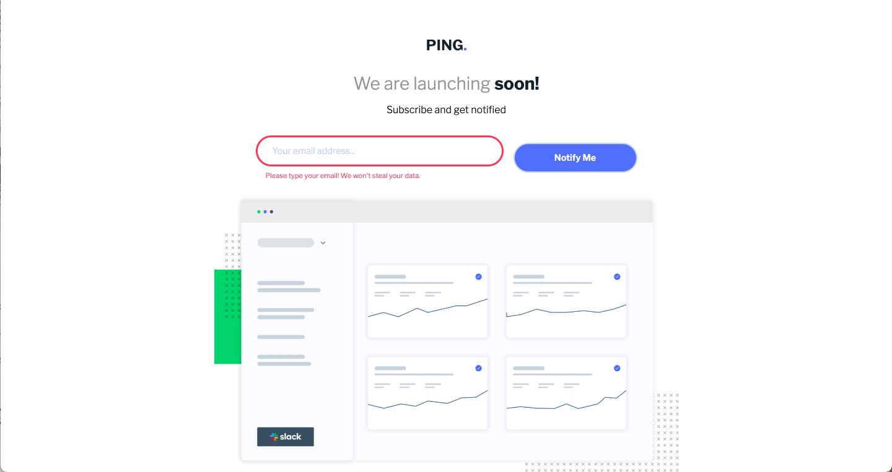

# Frontend Mentor - Ping coming soon page solution

This is a solution to the [Ping coming soon page challenge on Frontend Mentor](https://www.frontendmentor.io/challenges/ping-single-column-coming-soon-page-5cadd051fec04111f7b848da). Frontend Mentor challenges help you improve your coding skills by building realistic projects. 

## Table of contents

- [Overview](#overview)
  - [The challenge](#the-challenge)
  - [Screenshot](#screenshot)
  - [Links](#links)
- [My process](#my-process)
  - [Built with](#built-with)
- [Author](#author)

## Overview

### The challenge

Users should be able to:

- View the optimal layout for the site depending on their device's screen size
- See hover states for all interactive elements on the page
- Submit their email address using an `input` field
- Receive an error message when the `form` is submitted if:
	- The `input` field is empty.
	- The email address is not formatted correctly.

### Screenshot

### Links

- Solution URL: [Solution Repository](https://github.com/ponisworld/ping_landing_page)
- Live Site URL: [Add live site URL here](https://ponisworld.github.io/ping_landing_page/)

## My process

### Built with

- Semantic HTML5 markup
- CSS custom properties
- Flexbox
- Mobile-first workflow

## Author

- Website - [Andrea Bellver García](https://www.linkedin.com/in/andrea-bellver-garcia/)
- Frontend Mentor - [@ponisworld](https://www.frontendmentor.io/profile/ponisworld)
- Twitter - [@poniscript](https://www.twitter.com/poniscript)
